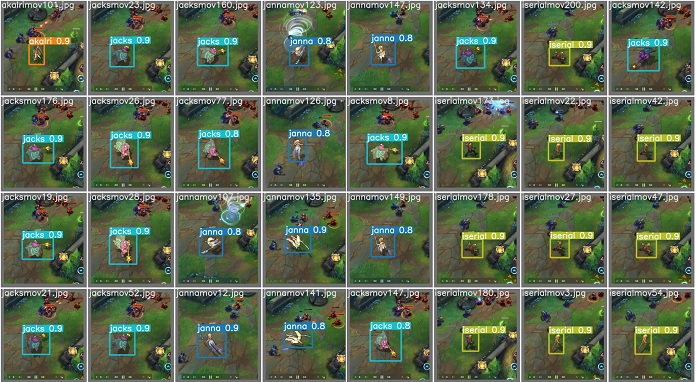
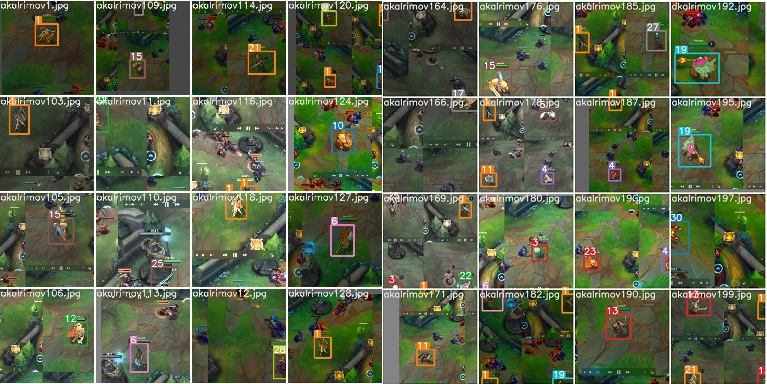

# yolov5를 이용한 리그오브레전드 영웅 인식

## 1. 학습 방법

해당 깃허브 참조 https://github.com/ultralytics/yolov5

트레이닝 관련 참조 https://github.com/ultralytics/yolov5/wiki/Train-Custom-Data

## 2. 제가 진행한 내용은 yolov5.ipynb파일에 있습니다.

## 3. 학습데이터

학습데이터는 제가 만든것을 공유하겠습니다. 

링크 에서 다운로드 하세요. 

https://drive.google.com/file/d/1tQHPoU-cvPv6IlsdIAhampioNiq1V_nU/view?usp=sharing

3천개 가량의 이미지와 레이블이 있습니다.

## 4. 레이블 관련 (클래스 개수 및 클래스 네임)

### number of classes
nc: 31
### class names
names: [ 'lol','akalri','alristar','amumu','aniw','ari','aseo','ashi','baruce','brize','buraum','buy','darious','dreibun','face','garen','gragas','graives','iserial','jacks','janna','jarban','jed','jicks','jin','jungkus','kaisa','kamil','kanun','korki','licin']

coco128.yaml 파일 작성시 참고하세요.

## 5. 트레이닝 후 결과물(이미지)

## 6. 실제 리그오브레전드 영상에서 영웅 찾기

# 학습데이터의 경우 다운로드 후 경로를 잘 찾아서 추가해야 합니다. 설치 모듈도 오류가 많이 날 수 있으니 검색 후 수정하여 사용하시기 바랍니다. 데스크탑에서 진행이 힘들다면 colab으로 하시는걸 추천합니다.
